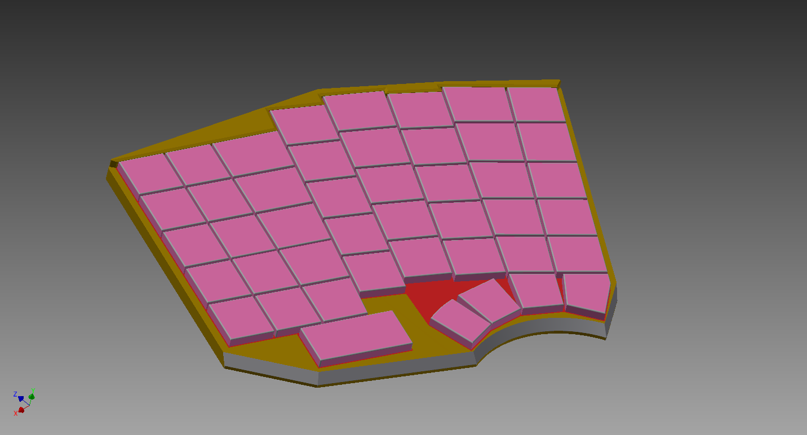

# Keyboard *hw_kbd*

A brand new way of deeply ergonomic slim keyboard design - HW &amp; SW

## Preliminary requirements

* selection from different variants
* both parts
    * wireless (working with Android out of the box)
    * wired (wire spool)
* some fixture/handle to fix both parts together in a space-saving manner
* backlit
* backlight (adjustable)
* anti-slippery stands (perhaps sucking disks)
* maybe water-proof

## Progress

### done

* preliminary design sketch ([screenshot1](design/model/201507181700-overview.png), [screenshot2](design/model/201507181701-overview.png))
* sump sketch (https://www.youtube.com/watch?v=kU6nasYpbfk)
* initial parts of HW circuit scheme ([screenshot1](hw/PR/20150720170901-screenshot.png), [screenshot2](hw/PR/20150720170926-screenshot.png))

### todo

* think of a better name for this project (hints: ergo, ergonomic, slim, portable, ...)
* contact Mr. P. Jakoubek, Mr. D. Kolibáč, and Mr. L. Hejkal regarding the plastic parts of scissor switches (injection moulding into a steel/aluminium mold?)
* choose a fitting HW license (similar to MIT and CC BY-SA 4.0, but with a notion about HW patents)
* investigate double-trackpoint/point_stick placement - (un)mountable?, each half it's own and fixed?, 90°-rotated thumb micro-switches on the side?
* marketing (Student Agency - no place for keyboard; ...)

## Remarks

* use ATmega128A (QFP-64) or ATmega64A (TQFP-64)
* TWI (Two Wire Interface) on Atmel is I2C
* SW USB circuit https://metalab.at/wiki/Metaboard
* 1-wire design guide PDF
* silicon rubber keys are for sale (http://sk.quad-ind.com/silikonove-klavesnice/ , http://www.unipad.cz/index.php/cs/silikonove-klavesnice)
* high-quality plastic manufacturing is affordable (price, time, quality) e.g. at http://www.shapeways.com/ (USA & Europe factories)

## Links for inspiration

* similar keyboard, but done in a megalomaniac way: http://www.key64.org/
* similar keyboard, but done in a yet more megalomaniac way: http://www.keyboard.io/
* similar keyboard, with high switches, but using the same design process as we did (it's unbelievable their design is from 2013, our from 2008, but we didn't share anything :open_mouth:): http://habrahabr.ru/post/177347/
* ZX81 USB kbd: http://blog.tynemouthsoftware.co.uk/2012/02/arduino-based-zx81-usb-keyboard.html
* IBM model M with USB: http://www.schatenseite.de/dulcimer.html?L=2
* IBM model M with USB: http://mg8.org/rump/
* Commodore 64 (C64) USB kbd: http://symlink.dk/projects/c64key/
* Mini Keyboard with Trackpoint: http://geekhack.org/showwiki.php?title=Island:4917&do=comments&page=83
* 3D printed keyboard: http://deskthority.net/workshop-f7/katy-keyboard-or-k80cs-key80-contoured-split-t8524.html
* Apple keyboard mod to NKRO + teensy: http://deskthority.net/viewtopic.php?f=7&t=1067
* SW USB implementation: http://www.obdev.at/products/vusb/index.html
* HW keyboard matrix explained in detail: http://blog.komar.be/how-to-make-a-keyboard-the-matrix/
* how to remove the old yellowish tint: http://retr0bright.wikispaces.com/

## Links for wishlist features

* Mini ZigBee / CC2530 Module; HC-06 Arduino Bluetooh Bee; XBee; Bluetooh Bee HC-05 Wireless Bluetooth; Geeetech XBee 2mW Wire Antenna
* HID for Bluetooth dongles in USB: http://anselm.hoffmeister.be/computer/hidclient/index.html.en

## Contributors

* Jiri Pacner (HW design)
* Pavel Pacner (3D models, media)
* Jan Pacner (initial idea, initial design, SW)
* *You* (you're more than welcome to join us!)

## Licensing

The following licenses apply if not stated otherwise:

* The SW part is under *MIT* (see `sw/LICENSE`).
* The HW part is under *CC BY-SA 4.0* (see `hw/LICENSE`).
* The rest is under *CC BY-SA 4.0* (see `design/LICENSE`).
