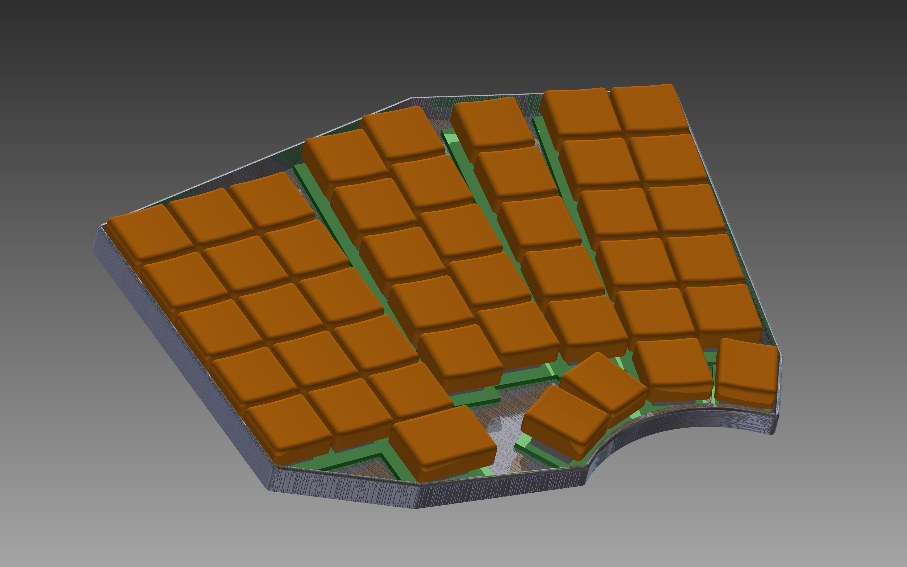

# Lingo Splix Board

A brand new deeply ergonomic slim keyboard - HW &amp; SW

## Features

1. **Slim low-profile design**
1. **Split into 2 halfs** for outstanding ergonomy
1. **Portable** - easily foldable
1. **USB connection** - use it anywhere
1. [**Modern look**](https://www.youtube.com/watch?v=RVa64frZOLY) - please your heart
1. **Open Source** - never be dependent

<!-- from creators of ULKL -->
<!-- has certification from the Czech Ergonomy Association -->

## Progress

### Done

* design animation
    * https://www.youtube.com/watch?v=RVa64frZOLY
* design sketch
    * [LSB sketch 201507181700](design/model/201507181700-overview.png)
    * [LSB sketch 201507181701](design/model/201507181701-overview.png)
    * [LSB sketch 201602232051](design/model/201602232051-overview-no_caps.png)
    * [LSB sketch 201602232052](design/model/201602232052-overview.png)
    * [LSB sketch 201602232053](design/model/201602232053-overview.png)
    * [LSB sketch 201602252030](design/model/201602252030-overview.png)
* sump sketch
    * https://www.youtube.com/watch?v=kU6nasYpbfk
    * [sump sketch left 201602252030](hw/PR/201602252030-sump.png)
* sump 3D print
    * [sump left 201604081601](hw/PR/201604081601-left_sump_3D_printed.jpg)
    * [sump left 201604081603](hw/PR/201604081603-left_sump_3D_printed.jpg)
* PCB circuit scheme
    * [PCB left 20150720170901](hw/PR/20150720170901-screenshot.png)
    * [PCB left 20150720170926](hw/PR/20150720170926-screenshot.png)
    * [PCB left 20160213212414](hw/PR/2016-02-13_212414-screenshot.png)
    * [PCB left 20160228174205](hw/PR/20160228174205-circuit.png)
    * [PCB left 20160228174213](hw/PR/20160228174213-circuit.png)
    * [PCB left 201604212151](hw/PR/201604212151-circuit.png)
    * [PCB left 201604212153](hw/PR/201604212153-circuit.png)
    * [PCB left 201604212154](hw/PR/201604212154-circuit.png)

### TODO

* contact P. Jakoubek, D. Kolibáč, and L. Hejkal regarding the plastic parts of scissor switches (injection moulding into a steel/aluminium mold?)
* choose a better fitting HW license (similar to MIT and CC BY-SA 4.0, but with a notion about HW patents in a way, that anyone using this or derived work can't be sued)
* investigate double-trackpoint/point_stick placement - (un)mountable?, each half it's own and fixed?, 90°-rotated thumb micro-switches on the side?
* marketing (Student Agency - no place for keyboard; ...)
* add numeric keyboard to be successful on market

## Remarks

* use ATmega128A (QFP-64) or ATmega64A (TQFP-64)
* wrong fuse calculation might temporarily "brick" an Atmel uC (see [Engbedded Atmel AVR Fuse Calculator](http://www.engbedded.com/fusecalc/ ))
* *TWI* (Two Wire Interface) on Atmel is *I2C*
* SW USB circuit https://metalab.at/wiki/Metaboard
* 1-wire design guide PDF
* silicon rubber keys are for sale (http://sk.quad-ind.com/silikonove-klavesnice/ , http://www.unipad.cz/index.php/cs/silikonove-klavesnice)
* high-quality plastic manufacturing is affordable (price, time, quality) e.g. at http://www.shapeways.com/ (USA & Europe factories)
* for 3D printing use the most high quality PLA available (see the *arm-netbook* mailing list at phcomp.co.uk): [Faberdashery](http://www.faberdashery.co.uk/tag/pla/ )

## Links for inspiration

* similar keyboard, but done in a megalomaniac way: http://www.key64.org/
* similar keyboard, but done in a yet more megalomaniac way: http://www.keyboard.io/
* similar keyboard, with high switches, but using the same design process as we did (it's unbelievable their design is from 2013, our from 2008, but we didn't share anything :open_mouth:): http://habrahabr.ru/post/177347/
* ZX81 USB kbd: http://blog.tynemouthsoftware.co.uk/2012/02/arduino-based-zx81-usb-keyboard.html
* IBM model M with USB: http://www.schatenseite.de/dulcimer.html?L=2
* IBM model M with USB: http://mg8.org/rump/
* Commodore 64 (C64) USB kbd: http://symlink.dk/projects/c64key/
* Mini Keyboard with Trackpoint: http://geekhack.org/showwiki.php?title=Island:4917&do=comments&page=83
* 3D printed keyboard: http://deskthority.net/workshop-f7/katy-keyboard-or-k80cs-key80-contoured-split-t8524.html
* Apple keyboard mod to NKRO + teensy: http://deskthority.net/viewtopic.php?f=7&t=1067
* SW USB implementation: http://www.obdev.at/products/vusb/index.html
* HW keyboard matrix explained in detail: http://blog.komar.be/how-to-make-a-keyboard-the-matrix/
* how to remove the old yellowish tint: http://retr0bright.wikispaces.com/
* TrackPoint history: https://news.ycombinator.com/item?id=9437780
* TrackPoint creator's collection of human interface devices: http://research.microsoft.com/en-us/um/people/bibuxton/buxtoncollection/default.aspx
* TrackPoint creator's notes about TrackPoint: http://research.microsoft.com/en-us/um/people/bibuxton/buxtoncollection/detail.aspx?id=60
* round plastic circles for index fingers mimicking a gliding TrackPoint

## Wishlist features

* selection from different variants (perhaps configurable)
    * Standard (full-featured big keyboard for power users)
    * Standard Wireless
    * Mini (cut-down version for portability and presentation)
    * Mini Wireless
* both halfs
    * wired (wire spool)
    * wireless (working with Android out of the box)
        * Mini ZigBee / CC2530 Module; HC-06 Arduino Bluetooh Bee; XBee; Bluetooh Bee HC-05 Wireless Bluetooth; Geeetech XBee 2mW Wire Antenna
        * HID for Bluetooth dongles in USB: http://anselm.hoffmeister.be/computer/hidclient/index.html.en
* fixture/handle/hinge to fix both halfs together in a space-saving manner
* backlit
* backlight (adjustable)
* anti-slippery stands (perhaps sucking disks)
* maybe water-proof

## Contributors

* Jiri Pacner (HW design)
* Itchy (HW design feedback)
* Pavel Pacner (3D models, media)
* Jan Pacner (initial idea, initial design, SW)
* *You* (you're more than welcome to join us!)

## Licensing

The following licenses apply if not stated otherwise:

* The SW part is under *MIT* (see `sw/LICENSE`).
* The HW part is under *CC BY-SA 4.0* (see `hw/LICENSE`).
* The rest is under *CC BY-SA 4.0* (see `design/LICENSE`).
